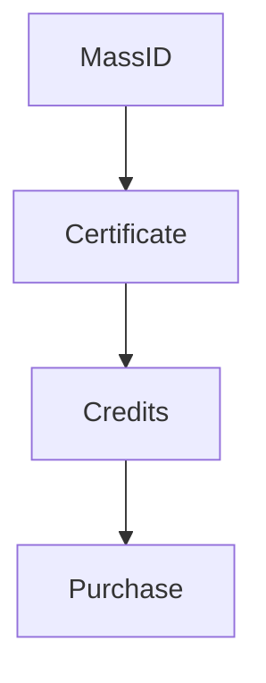

# Markdown Documentation Standards

## Document Structure & Organization

### Required Document Structure

Every markdown document MUST include:

1. **Primary header** (`# Title`) as the first line
2. **Overview/Description section** within the first 200 words
3. **Proper hierarchy** - no skipped header levels (h1 → h2 → h3, never h1 → h3)
4. **Consistent section ordering** for technical docs:
   - Overview/Purpose
   - Core concepts/definitions
   - Implementation details
   - Examples/usage
   - References/links

### Header Standards

- Use **sentence case** for headers: `# Core implementation details` not `# Core Implementation Details`
- No punctuation at end of headers
- Single space after `#` symbols
- Use emoji sparingly and consistently: `🔧 Technical Requirements` (max 1 emoji per header)
- Headers must be descriptive and scannable

```markdown
# Document title

## Primary section

### Subsection

#### Detail section
```

## Formatting Rules

### Lists

- Use `-` for unordered lists (consistent throughout document)
- Use `1.` for ordered lists with proper numbering
- Indent nested lists with 2 spaces
- Add blank line before and after lists
- Use consistent formatting for definition lists

```markdown
- Primary item
  - Nested item
  - Another nested item
- Second primary item

1. First ordered item
2. Second ordered item
   - Nested unordered item
3. Third ordered item
```

### Code Formatting

- ALWAYS specify language for code blocks: `javascript`, `solidity`, `bash`, etc
- Use backticks for inline code: `functionName()`, `variableName`
- Use code blocks for multi-line code, configuration, or commands
- Prefer descriptive language identifiers over generic ones

#### Good

```javascript
const result = processData(input);
```

#### Bad

```
const result = processData(input);
```

### Tables

- Use consistent column alignment
- Include header row separator
- Align content consistently within columns
- Keep tables readable in source format

```markdown
| Component   | Type  | Description                 |
| ----------- | ----- | --------------------------- |
| MassID      | NFT   | Root waste asset            |
| Certificate | NFT   | Environmental verification  |
| Credit      | Token | Fungible environmental unit |
```

### Links and References

- Use descriptive link text, avoid "click here" or "link"
- Prefer relative links for internal documentation
- Use reference-style links for repeated URLs
- Validate all external links regularly

```markdown
# Good

See the [smart contract architecture](./architecture.md) for details.
Learn more about [Ethereum's ERC-721 standard][erc721].

[erc721]: https://eips.ethereum.org/EIPS/eip-721

# Bad

Click [here](mdc:architecture.md) for more info.
```

## Content Quality Standards

### Writing Guidelines

- Use **active voice** where possible
- Keep sentences concise and clear
- Define technical terms on first use
- Use consistent terminology throughout project
- Write in present tense for current features, future tense for planned features

### Technical Documentation Requirements

- Include **code examples** for implementation guidance
- Provide **clear prerequisites** and dependencies
- Document **error conditions** and troubleshooting
- Include **version information** where applicable
- Add **migration notes** for breaking changes

## Line Length and Formatting

### Line Length

- **Soft limit**: 80 characters per line for readability
- **Hard limit**: 120 characters (exceptions for tables, URLs, code)
- Break long sentences at natural pauses
- Use hanging indents for wrapped list items

### Whitespace

- One blank line between sections
- Two blank lines before major headers (h1, h2)
- No trailing whitespace
- Single space after periods
- No tabs, use spaces for indentation

## Special Sections

### Architecture Diagrams

- Use mermaid diagrams for system architecture
- Include ASCII diagrams for simple flows
- Provide both high-level and detailed views
- Keep diagrams readable in source format

**Example:**



## Validation Rules

### Automated Checks

Implement these validation rules where possible:

- No broken internal links
- All code blocks have language specification
- Headers follow proper hierarchy
- No trailing whitespace
- Consistent list formatting
- Table formatting compliance

### Manual Review Checklist

- [ ] Document serves its stated purpose
- [ ] All technical terms are defined or linked
- [ ] Code examples are complete and functional
- [ ] External links are current and relevant
- [ ] Content is accurate and up-to-date
- [ ] Writing is clear and professional
- [ ] Document follows project style guide

## File Naming Conventions

### Standard Patterns

- Use **kebab-case** for file names: `smart-contract-architecture.md`
- Be descriptive but concise: `bold-recycling-methodology.md`
- Use consistent prefixes for document types:
  - `api-` for API documentation
  - `guide-` for user guides
  - `spec-` for technical specifications
  - `methodology-` for environmental methodologies

### Special Files

- `README.md` for project/directory overviews
- `CHANGELOG.md` for version history
- `CONTRIBUTING.md` for contribution guidelines
- `DEPLOYMENT.md` for deployment instructions

## Integration Requirements

### Cross-Reference Standards

- Link related documents explicitly
- Maintain a documentation index/map
- Use consistent anchor formatting: `#section-name`
- Validate cross-references during builds

### Template Compliance

Different document types should follow templates:

- **Technical specs**: Purpose → Architecture → Implementation → Examples
- **Methodologies**: Overview → Scope → Requirements → Process
- **User guides**: Introduction → Prerequisites → Steps → Troubleshooting
- **API docs**: Endpoint → Parameters → Response → Examples

## Error Prevention

### Common Issues to Avoid

- Skipping header levels (h1 → h3)
- Inconsistent list formatting
- Missing language specification in code blocks
- Broken internal links
- Trailing whitespace
- Inconsistent terminology
- Tables without proper formatting
- Code examples without context

### Quality Assurance

- Spell-check all content
- Verify all code examples are functional
- Test all links regularly
- Review for clarity and completeness
- Ensure consistent voice and tone
- Validate against project terminology
