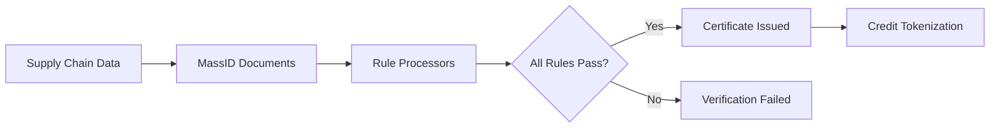

# Carrot Methodology Rules

[](https://github.com/carrot-foundation/methodology-rules/actions)
[](https://codecov.io/gh/carrot-foundation/methodology-rules)
[](https://github.com/carrot-foundation/methodology-rules/blob/main/LICENSE)

Open-source rule processors that power the [Carrot dMRV](https://docs.carrot.eco/docs/concepts/dmrv) (digital Measurement, Reporting and Verification) pipeline. Each rule processor validates a specific aspect of supply chain data against a [Methodology Verification Framework](https://docs.carrot.eco/docs/methodologies), producing deterministic, auditable verification results that underpin the issuance of environmental credits.

## How It Works



Every methodology in the Carrot Network has three layers:

| Layer | What | Where |
|-------|------|-------|
| **Methodology** | Scientific foundation (e.g., UNFCCC CDM) | [docs.carrot.eco](https://docs.carrot.eco/docs/methodologies) |
| **MvF** (Methodology Verification Framework) | Specification translating the methodology into concrete verification rules | [docs.carrot.eco](https://docs.carrot.eco/docs/methodologies/concepts/mvf) |
| **MvA** (Methodology Verification Application) | Open-source rule processors implementing the MvF | **This repository** · [docs](https://docs.carrot.eco/docs/methodologies/concepts/mva) |

Rule processors are the core units of the MvA. Each one evaluates [MassID](https://docs.carrot.eco/docs/concepts/mass-ids) documents — digital records tracking material type, weight, and chain of custody — and returns `PASSED` or `FAILED` with a traceable explanation.

## Project Structure

```
methodology-rules/
├── apps/methodologies/          # Methodology applications (Lambda deployments)
│   ├── bold-carbon/             #   BOLD Carbon CH₄
│   └── bold-recycling/          #   BOLD Recycling
├── libs/
│   ├── methodologies/bold/
│   │   └── rule-processors/     # Shared BOLD rule processors
│   │       ├── mass-id/         #   MassID verification rules
│   │       ├── credit-order/    #   Credit order rules
│   │       └── mass-id-certificate/  # Certificate rules
│   └── shared/                  # Shared libraries across methodologies
├── tools/                       # CLI tooling
│   ├── create-rule.js           #   Scaffold new rule processors
│   ├── rule-runner-cli/         #   Run rules locally against test data
│   ├── document-extractor-cli/  #   Extract data from documents
│   ├── apply-methodology-rule.js #  Apply rules to a methodology
│   └── versioning/              #   Rule version management
├── scripts/                     # Build & generation scripts
└── docs/                        # Internal documentation
```

## Getting Started

### Prerequisites

- [Node.js](https://nodejs.org/) v22.15.0 (see `.nvmrc`)
- [pnpm](https://pnpm.io/) v10.18.3 (see `packageManager` in `package.json`)

### Installation

```bash
pnpm install
```

### Common Commands

```bash
# Testing
pnpm test <project-name>            # Test a single project
pnpm test:affected                   # Test only changed projects
pnpm test:all                        # Test all projects

# Linting & type-checking
pnpm lint <project-name>             # Lint a single project
pnpm lint:affected                   # Lint and auto-fix changed projects
pnpm ts <project-name>              # Type-check a single project

# Building
pnpm build-lambda <project-name>     # Build a Lambda package
pnpm build-lambda:affected           # Build only changed Lambdas

# Run a single test file
pnpm nx test <project-name> --testFile=<relative-path>
```

### Tooling

```bash
pnpm create-rule                     # Scaffold a new rule processor
pnpm run-rule -- <args>              # Run a rule locally against test data
pnpm apply-methodology-rule          # Apply a rule to a methodology
```

## Rule Processor Design

Every rule processor follows a standardized pattern:

1. **`loadDocument()`** — Fetches the documents needed for evaluation
2. **`getRuleSubject()`** — Extracts the specific data elements to evaluate
3. **`evaluateResult()`** — Applies verification logic, returns `PASSED` or `FAILED`

Complex processors may override `process()` with custom document loading and evaluation logic.

Design principles:

- **Fidelity** — Mirrors the MvF specification exactly
- **Traceability** — Every result links back to source data
- **Determinism** — Same input always produces the same output
- **Standard compliance** — Follows [Carrot dMRV Standard](https://docs.carrot.eco/docs/concepts/dmrv) requirements

## Contributing

Contributions are welcome. Before starting work:

1. Read the [MvA Developer Guide](https://docs.carrot.eco/docs/methodologies/guides/mva-developer-guide) to understand the verification model
2. Use `pnpm create-rule` to scaffold new rule processors
3. Ensure 100% test coverage — this is enforced by CI
4. Follow [Conventional Commits](https://www.conventionalcommits.org/) for all commit messages

## Documentation

- [Carrot Documentation](https://docs.carrot.eco) — Full platform documentation
- [Methodology Overview](https://docs.carrot.eco/docs/methodologies) — How methodologies work
- [MvA Developer Guide](https://docs.carrot.eco/docs/methodologies/guides/mva-developer-guide) — Guide for rule processor developers
- [dMRV Standard](https://docs.carrot.eco/docs/concepts/dmrv) — Digital Measurement, Reporting and Verification

## License

This project is licensed under the [LGPL-3.0](LICENSE).
