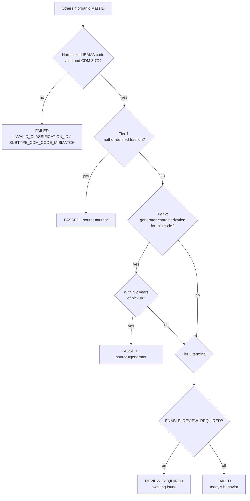
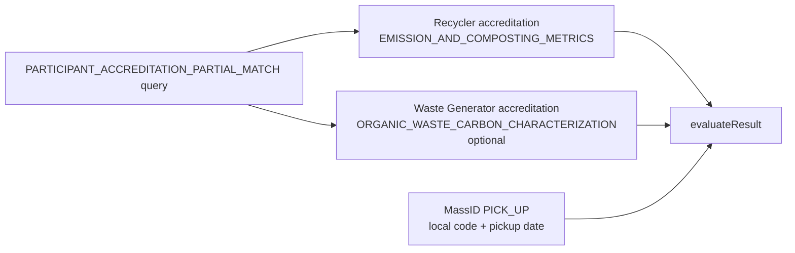

# Architecture diagrams — `Others (if organic)` carbon-fraction resolution

Companion to `SPEC.md` (`SPEC-others-organic-carbon-fraction`). Diagrams only; prose lives in the kernel.

## Tiered resolution flow

## Document retrieval (no new query)

